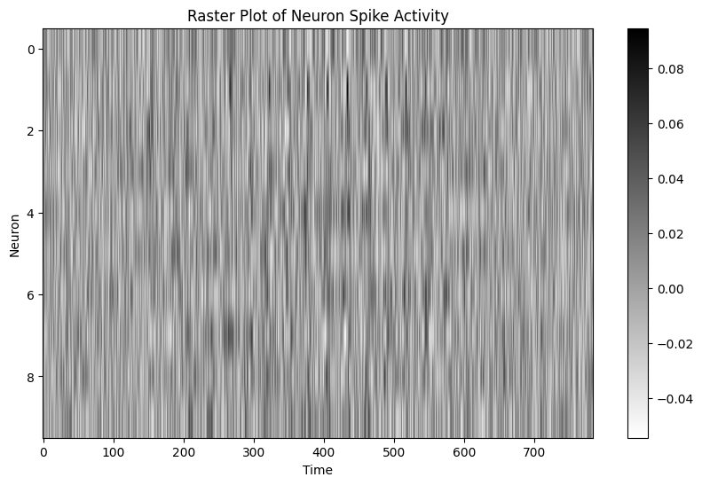
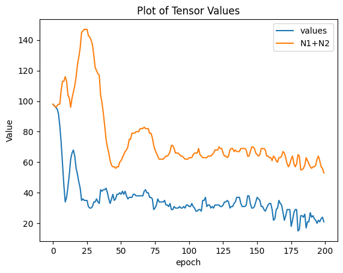
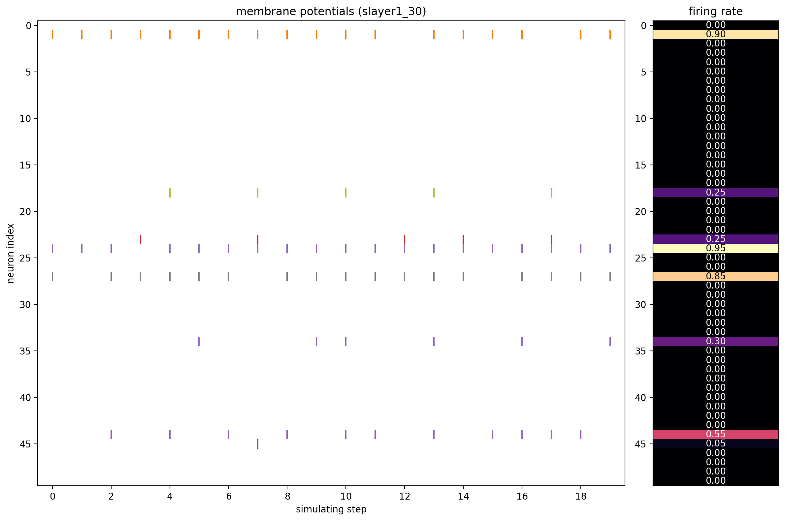
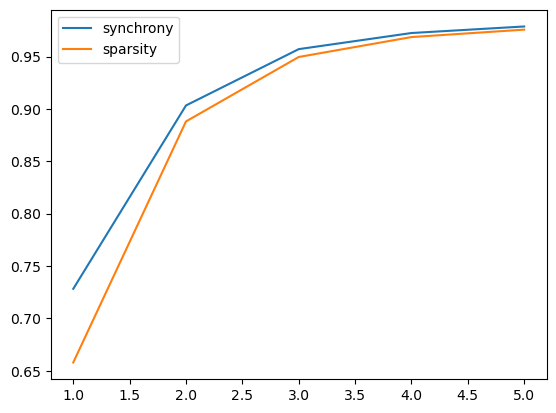
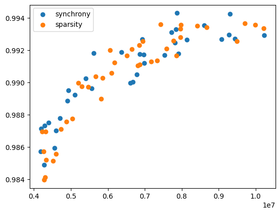
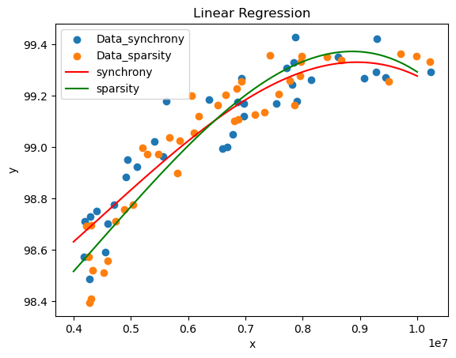

# A Hybrid Synchrony-Based Loss Function for Enhanced Spiking Neural Network Training

## Abstract 📜

This research introduces and evaluates a novel training paradigm for Spiking Neural Networks (SNNs) designed to leverage the temporal dynamics of spike trains for improved representation learning. Conventional SNN training methods often depend on rate-based coding, where the firing frequency is the primary information carrier, effectively overlooking the precise timing of spikes. We address this limitation by proposing a **hybrid loss function**. This function augments a standard classification loss with a custom **Synchrony Loss** component. This new loss term is meticulously engineered to minimize the temporal dissimilarity between spike trains of neurons associated with the same class (intra-class synchrony) while simultaneously maximizing the dissimilarity between those of different classes (inter-class desynchrony). We implement this methodology on fully-connected SNNs, testing it on the MNIST and Fashion-MNIST datasets. The results demonstrate that this approach not only serves as an effective regularizer but also actively structures the network's spiking activity into functionally distinct and temporally coherent neural assemblies.

---

## 1. Introduction and Motivation 🧠

Spiking Neural Networks (SNNs) represent a third generation of neural networks, drawing inspiration directly from the dynamics of biological neurons. Their event-driven and sparse processing capabilities promise significant gains in energy efficiency, particularly for edge computing and on specialized neuromorphic hardware.

However, the discrete, non-differentiable nature of the spiking mechanism complicates the training process. A common solution is to rely on **rate coding**, where the network's output is interpreted from the total number of spikes over a time window. While functional, this method discards the rich temporal information encoded in the precise timing and patterns of spikes, which neuroscientific evidence suggests is critical for computation in the brain.

This project is founded on the hypothesis that by explicitly guiding the *temporal structure* of spike trains during training, we can unlock more powerful and robust representations. We draw inspiration from the concept of **neural assemblies**, where groups of neurons coordinate their firing to represent specific stimuli or concepts. Our work aims to computationally foster the creation of these assemblies by introducing a loss function that directly rewards class-specific spike synchrony.

---

## 2. Methodology and Implementation 🛠️

Our methodology centers on the design and integration of the hybrid loss function into the SNN training loop.

### 2.1 Datasets and Pre-processing

* **MNIST & Fashion-MNIST**: Both datasets consist of 28x28 grayscale images. Each image is flattened into a 784-element vector.
* **Poisson Encoding**: To convert the static image pixels into a temporal format suitable for SNNs, we use Poisson encoding. Each pixel intensity `p` is used as the frequency parameter of a Poisson process to generate a spike train of length `T` (the number of simulation timesteps). Higher intensity pixels result in a higher probability of spiking at any given timestep.


<div align="center">

#### 🔹 *A visualization of am image's corresponding Poisson-encoded spike train would be beneficial here.*


</div>


### 2.2 Spiking Neuron Models

The core computational units of our network are spiking neurons, implemented using the **SpikingJelly** library.

1.  **Leaky Integrate-and-Fire (LIF) Neuron**: A standard, computationally efficient neuron model whose membrane potential leaks over time.
2.  **Parametric Leaky Integrate-and-Fire (PLIF) Neuron**: As defined in `model_PLIF_neuron_definition.ipynb`, this is a key component of our experiments. The PLIF neuron extends the LIF model by making the membrane potential decay factor, `v_decay`, a trainable parameter. By allowing the network to learn this parameter via backpropagation, each neuron can adapt its own temporal integration properties.

<div align="center">

#### 🔹*A plot showing the distribution of learned `v_decay` values for the hidden layer can illustrate neuron specialization.*


</div>


### 2.3 Network Architecture

We employ a simple yet effective fully-connected SNN:
`Input (784 neurons) -> Linear(784, 100) -> PLIF/LIF -> Linear(100, 10) -> PLIF/LIF`

### 2.4 The Hybrid Loss Function: The Core Innovation

The total loss `L_total` is the cornerstone of this project. It is a weighted sum of two distinct components:

$$ L_{total} = L_{class} + \lambda \cdot L_{sync} $$

The hyperparameter **`λ`** is crucial, as it controls the trade-off between prioritizing raw classification accuracy and enforcing temporal structure in the network.

---

## 3. Results and Analysis 📊

The project's notebooks serve as a complete record of experimentation and analysis.

### 3.1 Impact of Synchrony Loss on Spike Train Structure

The most direct way to observe the effect of our loss function is by visualizing the spike trains of the hidden layer neurons. When trained without the synchrony loss (`λ=0`), firing patterns are largely unstructured. When the synchrony loss is enabled (`λ>0`), neurons responding to the same class exhibit clear, coordinated firing patterns.

<div align="center">

#### 🔹*Caption: Comparative raster plots of hidden layer activity for the digit '3'. (Left) Trained with standard loss (`λ=0`), showing unstructured firing. (Right) Trained with hybrid loss (`λ=0.5`), showing structured, synchronous firing patterns.*



</div>


### 3.2 Training Dynamics

The hybrid loss function significantly alters the training dynamics. The plots below show the evolution of accuracy and the individual loss components over 100 epochs on the MNIST dataset.

| Training Accuracy | Synchrony Loss Component |
| :---: | :---: |
|  |  |
| *Caption: Test accuracy over epochs for different values of λ.* | *Caption: The synchrony loss component (`L_sync`) over epochs.* |

### 3.3 Accuracy vs. Sparsity Trade-off

The synchrony loss can be viewed as a regularizer. We analyzed the trade-off between final test accuracy and the average number of spikes per neuron, which is a proxy for energy consumption.


<div align="center">

#### 🔹*Caption: Final test accuracy plotted against the average spike count per neuron for models trained with different `λ` values. This highlights the trade-off between performance and computational sparsity.*




</div>


---

## 4. Conclusion and Future Directions 🚀

This research successfully demonstrates that by incorporating a temporally-aware synchrony objective directly into the loss function, we can effectively guide SNNs to form more structured and biologically plausible neural representations. This method acts as a powerful regularizer and opens a new avenue for leveraging the full potential of temporal coding in SNNs.

**Future Work:**
* **Architectural Scaling**: Apply the hybrid loss to more complex architectures, such as Convolutional SNNs (CSNNs), to tackle more challenging image datasets like CIFAR-10.
* **Advanced Synchrony Metrics**: Integrate more sophisticated and robust spike train distance metrics (e.g., SPIKE-distance or van Rossum distance) and evaluate their impact on performance.
* **Neuromorphic Deployment**: Investigate the energy consumption and latency of networks trained with this method when deployed on actual neuromorphic hardware like Loihi or SpiNNaker.

---

## 5. How to Use This Repository

1.  **Clone the repository:**
    ```bash
    git clone https://github.com/sabamadadi/snn-hybrid-synchrony-loss.git
    ```
2.  **Set up the environment:**
    Install the required Python packages.
    ```bash
    pip install torch torchvision spikingjelly numba matplotlib
    ```
3.  **Run an experiment:**
    Open `main_MNIST_fc_snn_hybrid_loss.ipynb` or `main_FMNIST_fc_snn_hybrid_loss.ipynb` in a Jupyter environment and execute the cells. You can modify hyperparameters like `T` (timesteps), `λ` (lambda), batch size, and learning rate within the notebook.
4.  **Analyze the results:**

    After training, use `analysis_spike_train_visualization.ipynb` and `analysis_final_results_and_plots.ipynb` to visualize the spiking activity and plot the performance metrics.
